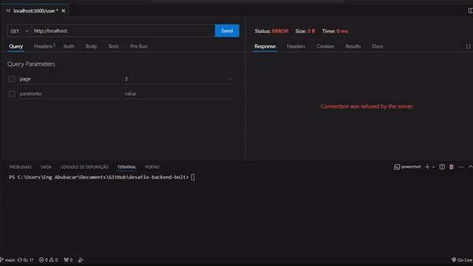

# Desafio Back - End do Bolt
este é uma api rest siples sem framework usando modulos nativo do node para consumir uma api externa do github.

## Referência

 - [GitHub API](https://docs.github.com/en/rest?apiVersion=2022-11-28)

## Documentação da API

Para testar esse projeto rode:

```bash
npm run dev
```
#### Retorna os itens requisitados

`GET http://localhost:3000/user/${name}`

| Parâmetro   | Tipo       | Descrição                                   |
| :---------- | :--------- | :------------------------------------------ |
| `name`      | `string` | **Obrigatório** caso não retorna **404**. |

#### Retorna os itens com a pagina indicada

`GET http://localhost:3000/user/${name}?page={page}`

| Parâmetro   | Tipo       | Descrição                                   |
| :---------- | :--------- | :------------------------------------------ |
| `page`      | `string ou number` | **Não obrigatório** por padrão retorna `page = 1`. |

## Apêndice

- node version require > v16 (LTS)

## Autores

- [@mussinady-abubcar](https://www.github.com/mussinady-abubcar)

## Etiquetas

[](https://choosealicense.com/licenses/mit/)

## Demonstração



<p align="center"> Developed with ❤️ by Mussinady Abubacar</p>